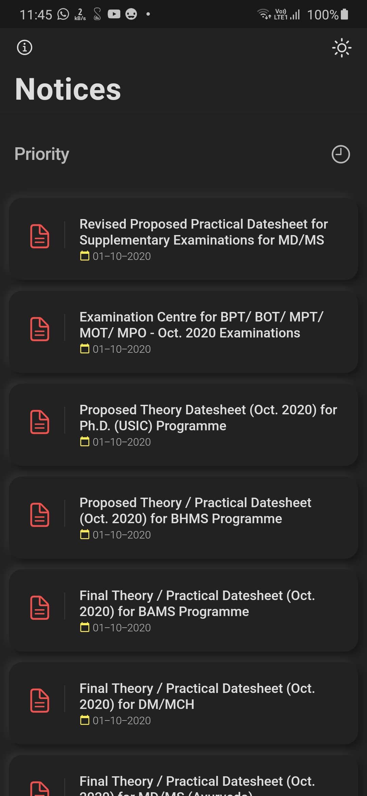
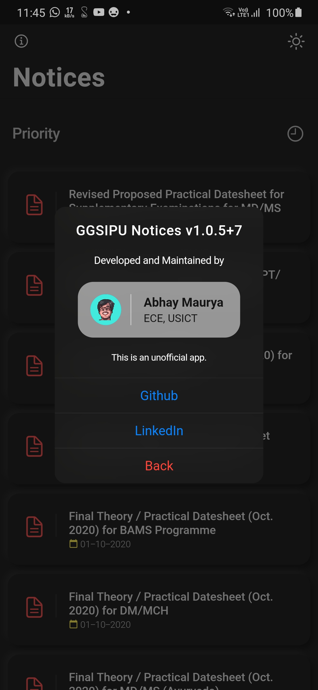

#  GGSIPU Notices App

This is a beautiful neuromorphic noticeboard app for Guru Gobind Singh Indraprastha University. This works on both Android and iOS.
>This is an unofficial App.

This app gets its source of notices from a Python and Flask server which I have deployed on Heroku. That server scrapes IP University's website every minute and updates the FireBase database and also sends a notification to the user if any new notice is found. The app provides the user with a fast and smooth experience filled with subtle animations and minimal design.

## List of Contents

1. [Features](#features)
2. [Demo](#demo)
3. [Dependencies](#dependencies)
4. [Usage](#usage)
5. [Development](#development)
6. [Contributors](#contributors)
7. [To-Do](#to-do)

## Features

- Minimal Design
- Dark Mode Supported
- Instanly opens notices on one tap
- Push Notifications for new notices
- Optimised storage using minimal packages
- Application size under 6 MB
- Adaptive UI (changes theme based on system default)

## Demo

|  |  |  |  |
| :-------------: | :-------------: | :-------------: | :-------------: |
|   Notice Board  |  About Page     |  Notice Board   |  About Page     |

## Dependencies

The following packages are needed for the development of this application.

- `flutter_neumorphic: ^1.0.7` for neumorphic design
- `firebase_database: 3.1.5` for notice database
- `firebase_messaging: ^6.0.13` for push notifications
- `url_launcher: ^5.4.5` for launching urls

More details about these can be found in the [`pubspec.yaml`](https://github.com/LiquidatorCoder/ggsipu_notice/tree/master/pubspec.yaml) file.

## Usage

The application files for Android devices can be found under the [`bin`](https://github.com/LiquidatorCoder/ggsipu_notice/tree/master/bin) folder.
- [`app-arm64-v8a-release`](/bin/app-arm64-v8a-release.apk) For most users, this will work. It is for ARM x64 based devices.
- [`app-armeabi-v7a-release`](/bin/app-armeabi-v7a-release.apk) It is for ARM-based devices.
- [`app-x86_64-release`](/bin/app-x86_64-release.apk) It is for x86 based devices.

## Development

Start by forking the repository, and then run `flutter pub get` in the local repository. You are now ready to modify, fix, update, or remove any feature in the app. If you want, you can create pull requests, we will be happy to welcome them.
To modify the server, make changes in `server/scraper.py` file.
>Note: This project requires Flutter Framework to be installed on your machine. You will also need Firebase and Firebase Cloud Messaging API Keys.

## Contributors

## To Do

- [x] Add app icon
- [x] Add splash screen(cancelled)
- [x] Refactor the app
- [x] Push notification
- [x] Settings page
- [ ] Pull to Refresh
- [x] About dev