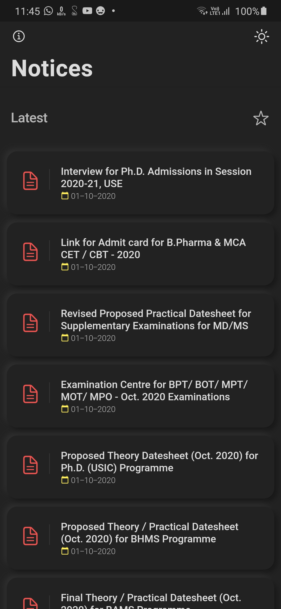
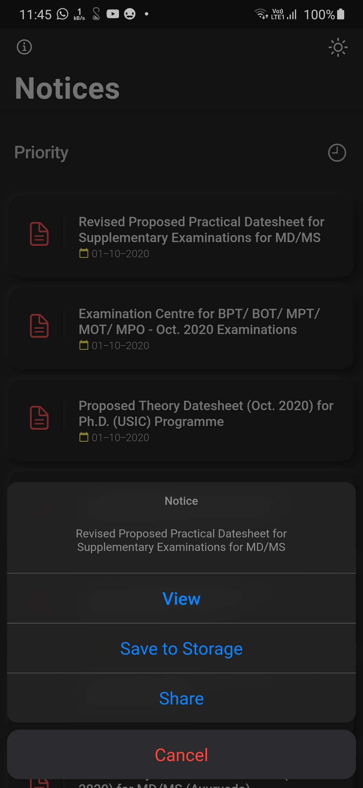

#  GGSIPU Noticeboard App

This is a beautiful neumorphic noticeboard app for Guru Gobind Singh Indraprastha University. This works on both Android and iOS.
>This is an unofficial App.


This app gets its source of notices from a Python and Flask server which I have deployed on Heroku. That server scrapes IP University's website every minute and updates the FireBase database and also sends a notification to the user if any new notice is found. The app provides the user with a fast and smooth experience filled with subtle animations and minimal design.

## List of Contents

1. [Features](#features)
2. [Demo](#demo)
3. [Support](#support)
4. [Dependencies](#dependencies)
5. [Usage](#usage)
6. [Development](#development)
7. [Contributors](#contributors)
8. [License](#license)

## Features

- Clean Neumorphic design
- Auto Dark Mode
- Instantly view or download notices in one tap
- Push Notifications for new notices
- Find notices by priority
- Fully optimised and smooth application
- Small application size (Under 6.5 MB)

## Demo

### Dark Theme

|  |  |  |  |
| :-------------: | :-------------: | :-------------: | :-------------: |
|   Latest        |    Priority     |  Notice Actions |      About      |

### Light Theme

|  |  |  |  |
| :-------------: | :-------------: | :-------------: | :-------------: |
|   Latest        |    Priority     |  Notice Actions |      About      |

## Support

If you like what we do, and would want to help us continue doing it, consider sponsoring this project.

<a href="https://www.buymeacoffee.com/HashStudios" target="_blank"></a>

GGSIPU Noticeboard app is now available on Google Play, so you can support us by giving a rating to the app.

<a href='https://play.google.com/store/apps/details?id=com.hash.ggsipu_notice'></a>


## Dependencies

The following packages are needed for the development of this application.

- `flutter_neumorphic: ^1.0.7` for neumorphic design
- `firebase_database: 3.1.5` for notice database
- `firebase_messaging: ^6.0.13` for push notifications
- `url_launcher: ^5.4.5` for launching urls
- `firebase_admob: ^0.9.3+4` for displaying ads in-app

More details about these can be found in the [`pubspec.yaml`](https://github.com/Hash-Studios/ggsipu_notice/tree/master/pubspec.yaml) file.

## Usage

The application files for Android devices can be found on [Google Play Store](https://play.google.com/store/apps/details?id=com.hash.ggsipu_notice).

More information about the releases can be found in the [Release](https://github.com/Hash-Studios/ggsipu_notice/releases) tab.


## Development

Start by forking the repository, and then run `flutter pub get` in the local repository. You are now ready to modify, fix, update, or remove any feature in the app. If you want, you can create pull requests, we will be happy to welcome them.
To modify the server, make changes in `server/scraper.py` file.
>Note: This project requires Flutter Framework to be installed on your machine. You will also need Firebase and Firebase Cloud Messaging API Keys.

## Contributors

<a href="https://github.com/Hash-Studios/ggsipu_notice/graphs/contributors">
  
</a>

Also, thanks to [Ashutosh Varma](https://github.com/ashutoshvarma) for helping in scraping notices from the university website. This wouldn't be possible without him so do check him out on GitHub.

## License

This app is licensed under the [`BSD 3-Clause License`](https://github.com/Hash-Studios/Prism/tree/master/LICENSE.txt).
Any Usage of the source code must follow the below license.

```
BSD 3-Clause License

Copyright (c) 2020 Hash Studios
All rights reserved.

Redistribution and use in source and binary forms, with or without
modification, are permitted provided that the following conditions are met:

1. Redistributions of source code must retain the above copyright notice, this
   list of conditions and the following disclaimer.

2. Redistributions in binary form must reproduce the above copyright notice,
   this list of conditions and the following disclaimer in the documentation
   and/or other materials provided with the distribution.

3. Neither the name of the copyright holder nor the names of its
   contributors may be used to endorse or promote products derived from
   this software without specific prior written permission.

THIS SOFTWARE IS PROVIDED BY THE COPYRIGHT HOLDERS AND CONTRIBUTORS "AS IS"
AND ANY EXPRESS OR IMPLIED WARRANTIES, INCLUDING, BUT NOT LIMITED TO, THE
IMPLIED WARRANTIES OF MERCHANTABILITY AND FITNESS FOR A PARTICULAR PURPOSE ARE
DISCLAIMED. IN NO EVENT SHALL THE COPYRIGHT HOLDER OR CONTRIBUTORS BE LIABLE
FOR ANY DIRECT, INDIRECT, INCIDENTAL, SPECIAL, EXEMPLARY, OR CONSEQUENTIAL
DAMAGES (INCLUDING, BUT NOT LIMITED TO, PROCUREMENT OF SUBSTITUTE GOODS OR
SERVICES; LOSS OF USE, DATA, OR PROFITS; OR BUSINESS INTERRUPTION) HOWEVER
CAUSED AND ON ANY THEORY OF LIABILITY, WHETHER IN CONTRACT, STRICT LIABILITY,
OR TORT (INCLUDING NEGLIGENCE OR OTHERWISE) ARISING IN ANY WAY OUT OF THE USE
OF THIS SOFTWARE, EVEN IF ADVISED OF THE POSSIBILITY OF SUCH DAMAGE.
```

```
DISCLAIMER: Google Play and the Google Play logo are trademarks of Google LLC.
```